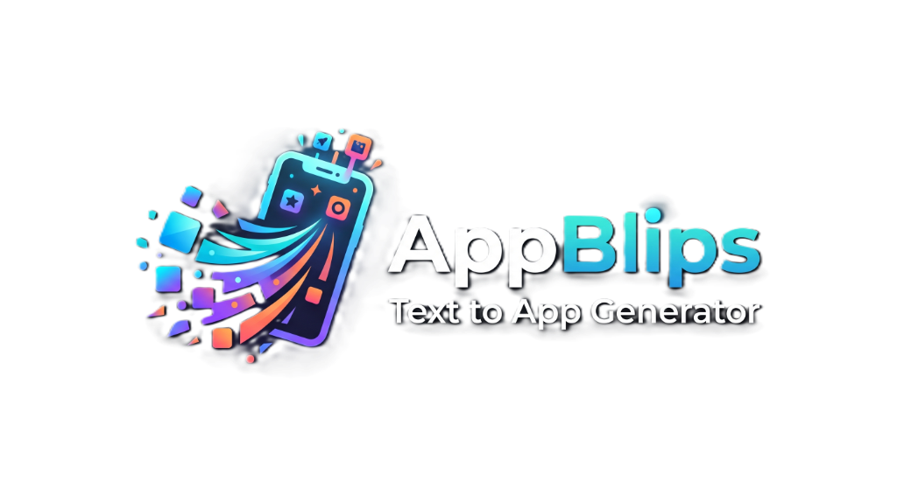

<p align="center">
  
</p>

<p align="center">
  <strong>The simple way to turn an idea into a working app.</strong><br />
  Describe what you want in plain English, watch it get built in seconds, and use it right away.
</p>

<p align="center">
  <a href="LICENSE"></a>
  <a href="https://github.com/techmitten/app-blips/stargazers"></a>
  
  
  
</p>

## Why AppBlips?

Tools like Bolt and Lovable are great, but they're built for developers — multi-file projects, build pipelines, and IDE-style interfaces. **AppBlips is built to be simple.** Every app you generate is just one file, the interface is a single prompt box and a live preview, and there's nothing extra to learn. If you want to describe an idea and get a real, working website or app back — without wading through a complicated tool built for professional developers — AppBlips is for you.

## What it is

AppBlips lets you describe an app or website in plain language and get back a working version you can preview, tweak, and use immediately. Type what you want, and AppBlips builds it as a single, self-contained file — no project setup, no separate files to manage, no build step to run before you can see it.

Under the hood, AppBlips is a React app that sends your prompt to an AI model through a single, built-in proxy and renders the result live in a safely sandboxed preview. Whoever sets up AppBlips (see [Quick start](#quick-start)) configures the AI connection once — as a user of the app, you never have to manage API keys or model settings yourself.

AppBlips is self-hosted software: you run it yourself, on your own machine or server. There's no sign-in, no account, and no cloud sync — just you and the app. Get it running with one command (see below).

## Features

- **One simple prompt box** — describe your idea in plain English and get a working app back
- **Instant live preview** — see exactly what you built, right next to the prompt, with no extra deploy step
- **Ask for changes in plain English** — request a tweak and AppBlips edits the app for you, no code required
- **Undo/redo** — every generation and edit is saved as a version you can always go back to
- **Mobile and desktop views** — check how your app looks on different screen sizes, with adjustable zoom

## Quick start

AppBlips is software you run yourself — there's no signup, and once it's running, using it is as simple as typing a prompt. Setup takes a few steps:

**Prerequisites:** [Node.js](https://nodejs.org/) 20+ and npm (npm comes bundled with Node.js).

```bash
git clone https://github.com/techmitten/app-blips.git   # download the project
cd app-blips                                            # move into the project folder
npm install                                              # install dependencies
cp .env.example .env                                     # create your local config file
```

Open the new `.env` file and set at minimum an AI provider to use:

```
APPBLIPS_LLM_BASE_URL=https://api.openai.com/v1
APPBLIPS_LLM_API_KEY=your-api-key
APPBLIPS_LLM_MODEL=gpt-4o
```

Then start AppBlips:

```bash
npm run dev
```

Open `http://localhost:5173` in your browser — that's it, you're ready to build.

## Running with Docker

A `Dockerfile` and `docker-compose.yml` are provided for self-hosted deployments. The image builds the static client and serves it (along with `/api/chat`) from a small dependency-free Node server (`server.js`) — no `wrangler` or Cloudflare-specific tooling required.

```bash
docker compose up --build
```

This reads environment variables from `.env` (same file as above) and serves the app on `http://localhost:3000`.

## Configuration

Everything about how AppBlips runs is set once, in your `.env` file — as a user you'll never see or touch this. All configuration is via environment variables — see [`.env.example`](.env.example) for the full, authoritative list. The key groups:

| Group | Variables | Notes |
| --- | --- | --- |
| LLM (required) | `APPBLIPS_LLM_BASE_URL`, `APPBLIPS_LLM_API_KEY`, `APPBLIPS_LLM_MODEL`, `APPBLIPS_LLM_MAX_TOKENS`, `APPBLIPS_LLM_REASONING_EFFORT` | Server-side only, never exposed to the browser bundle |
| Rate limiting (optional) | `APPBLIPS_CHAT_RATE_LIMIT_MAX`, `APPBLIPS_CHAT_RATE_LIMIT_WINDOW_SECONDS` | Config exists, but the underlying check is currently a stub that always allows requests |

> **Note:** `/api/chat` performs no authentication — every request is treated as the same local user. If you expose the app beyond localhost, you're responsible for putting your own access control in front of it.

---

*The sections below are for developers and self-hosters. If you just want to build apps, you're already set — open AppBlips and start typing.*

## Available scripts

| Command | Description |
| --- | --- |
| `npm run dev` | Start the Vite dev server on port 5173 |
| `npm run build` | Production build to `dist/` |
| `npm run lint` | Run ESLint |
| `npm run preview` | Preview the production build locally |

There's no automated test suite wired to `npm test`. The `testing/` directory holds standalone scripts run directly with Node (e.g. `node testing/test-reply.js`, `node testing/testSyntax.js`) that exercise generation and syntax-checking against a real LLM call or fixture HTML.

## Project structure

```
src/
  App.jsx              # Workspace/generation state, undo-redo, composition root
  previewBridge.js      # Script injected into generated apps to bridge the sandboxed iframe
  firebase.js           # Single Firebase SDK init point (no-op in self-hosted mode)
  lib/                   # Framework-free logic: LLM calls, surgical edits, prompts, deploy, crypto...
  hooks/                 # Stateful concerns: auth, projects, deployment, preview viewport...
  components/            # Presentational UI: Header, BuildPanel, PreviewPane, modals...
functions/               # Cloudflare Pages Functions: /api/chat proxy, deployed-app server
server.js                # Standalone Node server for Docker self-hosted deployments
testing/                 # Standalone Node scripts for exercising generation/syntax-checking
```

For a full architectural deep-dive (generation flow, preview sandboxing, LLM proxy internals, deploy pipeline), see [`CLAUDE.md`](CLAUDE.md).

## Security notes

- Generated apps are never rendered directly — they're injected into a sandboxed iframe (`sandbox` without `allow-same-origin`) with an opaque origin, so the app can't reach the parent page and the parent can't reach the app's DOM. See `src/previewBridge.js` for details.
- `/api/chat` has no token verification — every request is treated as the same local user, so anyone who can reach it can spend your configured AI budget. Don't expose it beyond localhost without adding your own access control.

## Contributing

Issues and pull requests are welcome. Please run `npm run lint` before submitting a PR. See [`CLAUDE.md`](CLAUDE.md) for a detailed guide to the codebase's architecture and conventions.

## License

MIT — see [LICENSE](LICENSE).
