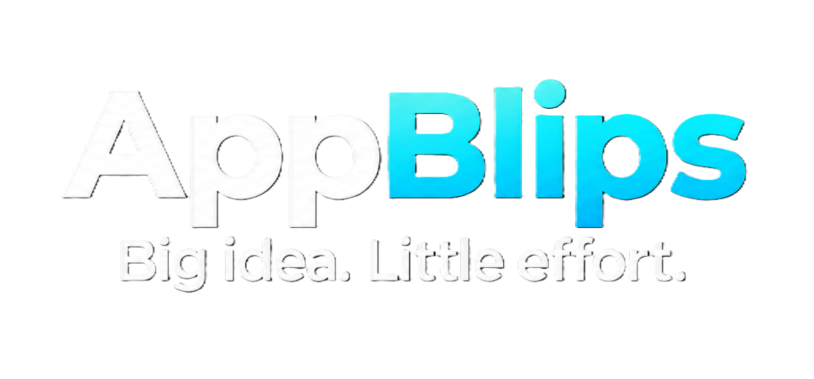

<p align="center">
  
</p>

<p align="center">
  <strong>The simple way to turn an idea into a working app or website.</strong><br />
  Describe what you want in plain English, watch it get built in seconds, and use it right away.
</p>

<p align="center">
  <a href="https://appblips.com">Website</a> ·
  <a href="https://docs.appblips.com/">Documentation</a> ·
  <a href="https://docs.appblips.com/quickstart-self-hosted">Self-hosting guide</a> ·
  <a href="#license">License</a>
</p>

<p align="center">
  <a href="LICENSE"></a>
  <a href="https://docs.appblips.com/"></a>
  <a href="https://github.com/techmitten/app-blips/stargazers"></a>
  
  
  
</p>

https://github.com/user-attachments/assets/f4bc6002-6cbe-4529-a027-49d5292c3820

## Why AppBlips?

Tools like Bolt and Lovable are great, but they're built for developers — multi-file projects, build pipelines, and IDE-style interfaces. **AppBlips is built to be simple.** Every app or website you generate is just one file, the interface is a single prompt box and a live preview, and there's nothing extra to learn. If you want to describe an idea and get a real, working app or website back — without wading through a complicated tool built for professional developers — AppBlips is for you.

## What it is

AppBlips lets you describe an app or website in plain language and get back a working version you can preview, tweak, and use immediately. Type what you want, and AppBlips builds it as a single, self-contained file — no project setup, no separate files to manage, no build step to run before you can see it.

AppBlips has two studios, switchable from the header:

- **App Studio** — interactive tools, games, and dashboards. JavaScript-driven, saves its data in the browser, and designed to feel native on a phone (mobile preview by default).
- **Website Studio** — content-first pages such as landing pages, portfolios, restaurant or business sites, and blogs. It builds real website anatomy (navigation, hero, content sections, footer), is designed desktop-first and reflows down to phones, and comes with its own starter ideas. Websites are static and informational by default, and you can edit them by clicking elements directly in the preview.

Both studios share the same workflow: prompt, live preview, versions, export, and deploy.

Under the hood, AppBlips is a React app that sends your build prompt to an AI model through a server-side proxy and renders the result live in a safely sandboxed preview. That builder connection is configured by whoever operates AppBlips. Apps created with the AI toggle use a separate generated-app AI connection described below.

There are two ways to run it:

- **Hosted** ([appblips.com](https://appblips.com)) — the official service. Sign in and build straight from your browser, with nothing to install. Your projects sync to your account, and any app or website can be deployed to its own public URL as an installable PWA.
- **Self-hosted** — run your own copy on your computer, for your own use. A single local user, no sign-in and no cloud sync — just you and the app. See [License](#license) for what is allowed.

See [Quick start](#quick-start) below to pick one.

## Features

- **One simple prompt box** — describe your idea in plain English and get a working app or website back
- **App and Website studios** — pick the studio that fits; each has its own prompts, starter ideas, and default preview size
- **Click-to-edit websites** — in the Website Studio, click text, images, and links right in the preview to change them directly, with an AI-assisted edit through chat when a change needs more than a direct edit
- **Instant live preview** — see exactly what you built, right next to the prompt, with no extra deploy step
- **Ask for changes in plain English** — request a tweak and AppBlips edits the app or website for you, no code required
- **Attach images** — drop in a screenshot or reference picture and have AppBlips build from it
- **AI-powered generated apps** — turn on AI before building and ask for features that call `blip.ai.text(...)`
- **Undo/redo** — every generation and edit is saved as a version you can always go back to
- **Mobile and desktop views** — check how your app or website looks on different screen sizes, with adjustable zoom
- **Export to HTML** — download any generated app or website as a single self-contained HTML file, ready to host or share anywhere
- **Deploy to a public URL** *(hosted only)* — publish an app or website to its own link, installable as a PWA and optionally password-protected

## Documentation

Full guides live at **[docs.appblips.com](https://docs.appblips.com/)**: an [introduction](https://docs.appblips.com/introduction), the [hosted](https://docs.appblips.com/quickstart-hosted) and [self-hosted](https://docs.appblips.com/quickstart-self-hosted) quickstarts, and feature and AI guides.

## Quick start

### Hosted (suggested)

Go to **[appblips.com](https://appblips.com)**, sign in, and start typing. There's nothing to install and no API key to bring. Apps you deploy are automatically assigned their own public URL and are installable as PWAs.

### Self-hosted

Prefer to run AppBlips on your own computer? There is no signup, and once it is running, using it is as simple as typing a prompt. You need one server-side API key to power the builder. AI inside the apps you build uses the same key.

**Prerequisites:** [Node.js](https://nodejs.org/) 20.19+ (or 22.12+) and npm (npm comes bundled with Node.js).

```bash
git clone https://github.com/techmitten/app-blips.git   # download the project
cd app-blips                                            # move into the project folder
npm install                                             # install dependencies
cp .env.example .env                                    # create your local config file
```

Open the new `.env` file and fill in **two lines**: the API key for one AI provider, and the model. The file lists OpenAI, OpenRouter, DeepSeek and Z.ai; a provider is active once its key is filled in, so leave the others blank:

```
APPBLIPS_OPENAI_API_KEY=your-api-key
APPBLIPS_LLM_MODEL=gpt-5.1
```

Use OpenRouter to reach Claude, Gemini and most other models. Any other OpenAI-chat-completions-compatible endpoint works too (see "Advanced" in `.env.example`). When AppBlips starts, it prints which provider it found and what is still missing.

Then start AppBlips:

```bash
npm run dev
```

Open `http://localhost:5175` in your browser — that is it, you are ready to build.

### AI inside the apps you build

Turn on the **AI** switch before generating or refining an app, then describe the feature in ordinary language. For example:

> Build a joke-writing app. When someone chooses a topic and presses Generate, call `blip.ai.text` to write one short, family-friendly joke, show a loading state, and display a friendly retry message if it fails.

AppBlips teaches the generated code the `blip.ai.text(messages, options)` API. References such as `BLIP.AI.TEXT` in a build prompt are accepted too; generated JavaScript uses the canonical lowercase form.

By default, AI in your apps uses the same provider and model as the builder, so there is nothing extra to set up. If you would rather have each person bring their own key, set `APPBLIPS_GENERATED_AI_MODE=byok`. In that self-hosted `byok` mode, the first AI request in the preview or exported app opens a small **Connect your AI provider** dialog. The person using the finished app enters an OpenAI-compatible endpoint, a model name, and their own API key. The key is stored only in that browser: session storage by default, or local storage when **Remember on this device** is selected. It is never inserted into the generated HTML or saved in the AppBlips project. The provider must allow browser requests with CORS.

The generated app can also expose a settings action that calls `blip.ai.configure()`. It can check `blip.ai.isConfigured()` and disconnect with `blip.ai.clearConfiguration()`. App authors do not need to design their own API-key form.

When self-hosted, generated apps reach your provider through your own AppBlips at `/api/app-ai/chat`. They always share the builder's provider, key and model. The browser only ever receives the relay URL; the provider key stays in your `.env`.

## Running with Docker

If you'd rather not run the dev server, you can use Docker instead of `npm run dev`. The image builds the static client and serves it — along with the builder `/api/chat` endpoint and optional `/api/app-ai/chat` relay — from a small dependency-free Node server ([`server.js`](server.js)), so no `wrangler` or Cloudflare-specific tooling is required.

```bash
docker compose up --build
```

This reads environment variables from the same `.env` file as above and serves the app on `http://localhost:3000`. The port is bound to `127.0.0.1`, so only your own computer can reach it.

`APPBLIPS_GENERATED_AI_MODE` and `APPBLIPS_APP_AI_RELAY_URL` are baked into the client at build time, so after changing either one, rerun `docker compose up --build` (a plain restart won't pick it up). Other variables are read at runtime.

## Configuration

Your settings live in the `.env` file. With `APPBLIPS_GENERATED_AI_MODE=byok`, each person using a finished AI-enabled app supplies their own provider settings in that app instead. See [`.env.example`](.env.example) for the full, authoritative list. The key groups:

| Group | Variables | Notes |
| --- | --- | --- |
| LLM (required, one provider) | `APPBLIPS_OPENAI_API_KEY`, `APPBLIPS_OPENROUTER_API_KEY`, `APPBLIPS_DEEPSEEK_API_KEY` or `APPBLIPS_ZAI_API_KEY`, plus `APPBLIPS_LLM_MODEL` | A provider is active when its key is filled in; if several are, the first listed wins, or set `APPBLIPS_LLM_PROVIDER`. Any other OpenAI-compatible API: `APPBLIPS_LLM_BASE_URL`, `APPBLIPS_LLM_API_KEY`, `APPBLIPS_LLM_MODEL`. Server-side only, never exposed to the browser bundle |
| LLM tuning (optional) | `APPBLIPS_LLM_MAX_TOKENS`, `APPBLIPS_LLM_ASK_MAX_TOKENS`, `APPBLIPS_LLM_TEMPERATURE` | `APPBLIPS_LLM_ASK_MAX_TOKENS` caps Ask-mode replies only (default `8192`, independent of `APPBLIPS_LLM_MAX_TOKENS`). `APPBLIPS_LLM_TEMPERATURE` defaults to `0.2`. Building reasoning effort is a per-user choice in the app's Settings modal; edits, error repair and chat replies are always low |
| Rate limiting (optional) | `APPBLIPS_CHAT_RATE_LIMIT_MAX`, `APPBLIPS_CHAT_RATE_LIMIT_WINDOW_SECONDS` | Per-user limit on `/api/chat`, defaulting to 60 requests per 300s. Tracked in memory per server instance, so treat it as a speed bump rather than a hard budget cap |
| Generated-app AI mode | `APPBLIPS_GENERATED_AI_MODE`, `APPBLIPS_APP_AI_RELAY_URL` | Self-hosted only. The default `relay` sends app AI through your builder provider; `byok` makes each person using a finished app bring their own key |
| Generated-app AI limits (optional) | `APPBLIPS_APP_AI_MAX_TOKENS`, `APPBLIPS_APP_AI_TEMPERATURE`, `APPBLIPS_APP_AI_REASONING_EFFORT` | AI in generated apps always uses the builder's provider, key and model; only these limits are separate (defaults: 4096 tokens, 0.2, reasoning off) |
| Generated-app relay controls | `APPBLIPS_APP_AI_ALLOWED_ORIGINS`, `APPBLIPS_APP_AI_RATE_LIMIT_MAX`, `APPBLIPS_APP_AI_RATE_LIMIT_WINDOW_SECONDS` | Exact cross-origin allowlist and per-IP in-memory rate limit |
| Deployed-app AI sessions | `APPBLIPS_SESSION_SECRET`, `APPBLIPS_AI_SESSION_TTL_SECONDS`, `APPBLIPS_AI_REQUIRE_SESSION`, `APPBLIPS_AI_REQUIRE_ORIGIN`, `TURNSTILE_SECRET`, `VITE_AI_SESSION_ENABLED`, `VITE_AI_TURNSTILE_SITE_KEY` | Used only by the official appblips.com deployment. Replaces the durable in-HTML deployment token with short-lived, server-signed session tokens minted at `/ai/session`; optional Turnstile gate |
| Hosting mode | `SELF_HOSTED_MODE` | Defaults to self-hosted and is not in `.env.example`. `false` enables the Firebase-backed hosted mode that runs appblips.com; its settings are in [`.env.hosted.example`](.env.hosted.example). See [License](#license) |

> **Note:** self-hosted AppBlips is meant to run on your own computer. `/api/chat` performs no authentication — every request is treated as the same local user — so keep it on localhost. If you reach it from other devices on your network, put your own access control in front of it.

---

*The sections below are for developers working on AppBlips itself. If you just want to build apps, you're already set — open AppBlips and start typing.*

## Available scripts

| Command | Description |
| --- | --- |
| `npm run dev` | Start the Vite dev server on port 5175 |
| `npm run build` | Production build to `dist/` |
| `npm run lint` | Run ESLint |
| `npm run preview` | Preview the production build locally |
| `npm run usage` | Usage dashboard for the appblips.com maintainers (hosted mode only; needs the Firebase CLI logged in) |

There's no automated test suite wired to `npm test`. The `testing/` directory holds standalone scripts run directly with Node (e.g. `node testing/testChatProxy.js`, `node testing/test-ai-relay.js`) that exercise the proxy, AI relay, bridge and preview behavior.

## Project structure

```
src/
  App.jsx            # Workspace/generation state, undo-redo, composition root
  previewBridge.js   # Script injected into generated apps to bridge the sandboxed iframe
  firebase.js        # Single Firebase SDK init point (no-op in self-hosted mode)
  lib/               # Framework-free logic: LLM calls, surgical edits, prompts, deploy, crypto...
  hooks/             # Stateful concerns: auth, projects, deployment, preview viewport...
  components/        # Presentational UI: Header, BuildPanel, PreviewPane, modals...
functions/           # /api/chat proxy and AI relays, plus the Cloudflare Pages Functions behind appblips.com
server.js            # Standalone Node server used by the Docker setup
scripts/             # Maintainer tooling for appblips.com (usage dashboard)
testing/             # Standalone Node scripts for exercising the proxy, AI relay and preview
```

For a full architectural deep-dive (generation flow, preview sandboxing, LLM proxy internals, deploy pipeline), see [`CLAUDE.md`](CLAUDE.md).

## Security notes

- Generated apps are never rendered directly — they're injected into a sandboxed iframe (`sandbox` without `allow-same-origin`) with an opaque origin, so the app can't reach the parent page and the parent can't reach the app's DOM. See [`src/previewBridge.js`](src/previewBridge.js) for details.
- Self-hosted BYOK credentials are entered explicitly by the finished-app user and live in browser storage only. Session storage is the default; persistent storage is opt-in. They are never bundled into HTML, but the provider must permit browser CORS and any script running in that app can access that key while it is connected.
- The self-hosted generated-app relay (`/api/app-ai/chat`) spends your provider key. It only accepts same-origin calls unless you list other origins in `APPBLIPS_APP_AI_ALLOWED_ORIGINS`, and its per-IP limiter is a speed bump, not a billing boundary. Keep it on your own machine.
- In self-hosted mode, `/api/chat` has no token verification — every request is treated as the same local user, so anyone who can reach it can spend your configured AI budget. Keep it on localhost, or add your own access control if other devices can reach it. (In hosted mode the proxy requires a valid Firebase ID token and App Check token.)
- On appblips.com, deployed apps are served from a separate hostname, never the app's own origin — they're AI-generated code with full script privileges, so keeping them off-origin stops them reading anything the SPA stores.

## License

AppBlips is licensed under the **Elastic License 2.0 (ELv2)**.

This is a source-available license: the code is public, but it can't be turned into a competing service.

**What you can do:**
- Run AppBlips on your own computer for your own use, or inside your own organization, free of charge.
- Modify the code, and share copies or modified versions, as long as you keep the license and copyright notices and mark your changes.

**What you can't do:**
- Offer AppBlips to other people as a hosted or managed service, whether paid or free. The public service at [appblips.com](https://appblips.com) is run by TechMitten LLC.

The hosted-mode code (Firebase sign-in, cloud projects, public deploys, and [`.env.hosted.example`](.env.hosted.example)) is in this repository because it powers appblips.com. It is not a supported setup for anyone else.

For the full legal terms, read the [LICENSE](LICENSE) file.
