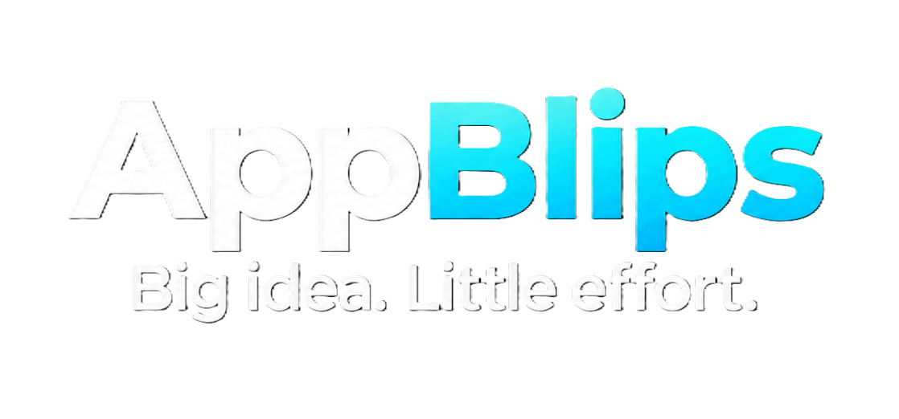

<p align="center">
  
</p>

<p align="center">
  <strong>The simple way to turn an idea into a working app or website.</strong><br />
  Describe what you want in plain English, watch it get built in seconds, and use it right away.
</p>

<p align="center">
  <a href="LICENSE"></a>
  <a href="https://docs.appblips.com/"></a>
  <a href="https://github.com/techmitten/app-blips/stargazers"></a>
  
  
  
</p>

https://github.com/user-attachments/assets/f4bc6002-6cbe-4529-a027-49d5292c3820

<p align="center">
  <a href="https://appblips.com">Website</a> ·
  <a href="https://docs.appblips.com/">Documentation</a> ·
  <a href="https://github.com/TechMitten/app-blips/releases">Download</a> ·
  <a href="#license">License</a>
</p>

## Why AppBlips?

**AppBlips is built for everyone.** If you've never written a line of code, you can describe what you want in plain language and use the result a few seconds later. If you code every day, you get a fast way to sketch ideas, prototype tools, and build small apps and games without setting up a project. Every app or website is designed around plain-language prompting, instant preview, and a clean path from idea to working result, and the code is always there to read, export, and change. AppBlips strips away setup work so you can focus on the app itself.

## What it is

AppBlips lets you describe an app, a game, or a website in plain language and get back a working version you can preview, tweak, and use immediately. Type what you want, and AppBlips builds it as a single, self-contained app or game, or a website with the structure and styling you asked for.

AppBlips has three studios, chosen from the launch screen:

- **App Studio** — interactive tools and dashboards. JavaScript-driven, saves its data in the browser, and designed to feel native on a phone (mobile preview by default).
- **Website Studio** — content-first pages such as landing pages, portfolios, restaurant or business sites, and blogs. It builds real website anatomy (navigation, hero, content sections, footer), then lets you refine it with prompts or click-to-edit tools.
- **Game Studio** — playable browser games with a real game loop: raw Canvas 2D for simple arcade games or the Phaser 3 engine (loaded from CDN) for sprite, tilemap and physics-heavy games, with controls, scoring, levels, juice, and sound tuned for both touch and keyboard.

The studios share the same workflow: prompt, live preview, versions, and export.

Under the hood, AppBlips is a React app that sends your build prompt to an AI model through a server-side proxy and renders the result live in a safely sandboxed preview. That builder connection is how it turns plain-English requests into quickly editable output.

AppBlips is self-hosted. You can run it:

- **Desktop app** (Windows and Linux) — your own copy, installed on your computer and powered by your own AI provider key. No account, no cloud sync, and your projects are saved as folders you can back up or move.
- **From source or Docker** — for macOS, servers, or to change AppBlips itself. It runs as a single-user install and saves projects locally.

See [Quick start](#quick-start) below to pick one.

## Features

- **One simple prompt box** — describe your idea in plain English and get a working app, game, or website back
- **App, Website, and Game studios** — pick the studio that fits; each has its own prompts, starter ideas, and default preview size
- **Click-to-edit websites** — in the Website Studio, click text, images, and links right in the preview to change them directly, with an AI-assisted edit through chat when a change needs more nuance
- **Instant live preview** — see exactly what you built, right next to the prompt, with no extra deploy step
- **Ask for changes in plain English** — request a tweak and AppBlips edits the app, game, or website for you, no code required
- **Attach images** — drop in a screenshot or reference picture and have AppBlips build from it
- **AI-powered generated apps** — turn on AI before building and ask for features that call `blip.ai.text(...)`
- **Undo/redo** — every generation and edit is saved as a version you can always go back to
- **Mobile and desktop views** — check how your app or website looks on different screen sizes, with adjustable zoom
- **Export to HTML** — download any generated app or website as a single self-contained HTML file, ready to host or share anywhere


## Documentation

Full guides live at **[docs.appblips.com](https://docs.appblips.com/)**: an [introduction](https://docs.appblips.com/introduction), the [desktop app](https://docs.appblips.com/quickstart-desktop) and [run-from-source](https://docs.appblips.com/quickstart-self-hosted) quickstarts, and the [app creator docs](https://docs.appblips.com/creator).

## Quick start

### Desktop app (Windows and Linux)

Want your own copy on your computer? Download the installer for your system from **[Releases](https://github.com/TechMitten/app-blips/releases)**:

- **Windows:** `AppBlips-Setup-<version>.exe`
- **Linux:** `AppBlips-<version>-x86_64.AppImage` (any distribution) or `AppBlips-<version>-amd64.deb` (Debian, Ubuntu and derivatives)

The first time you open it, AppBlips asks for an AI provider, a model and your API key. OpenAI, OpenRouter (for Claude, Gemini and most other models), DeepSeek and Z.ai (pay-as-you-go or a GLM Coding Plan) are supported. Your key is encrypted with your system keychain, and your projects are saved in `Documents/AppBlips/Projects`. See the [desktop app guide](https://docs.appblips.com/quickstart-desktop) for details, including how to bring over projects from a browser copy.

The app tells you when a new version is out. On Windows and with the AppImage it downloads the update itself and offers to restart; you can turn the check off in Settings → Workspace.

On macOS, or want to change AppBlips itself? See [Running from source](#running-from-source) below.

### AI inside the apps you build

Turn on the **AI** switch before generating or refining an app, then describe the feature in ordinary language. For example:

> Build a joke-writing app. When someone chooses a topic and presses Generate, call `blip.ai.text` to write one short, family-friendly joke, show a loading state, and display a friendly retry message if the request fails.

AppBlips teaches the generated code the `blip.ai.text(messages, options)` API. References such as `BLIP.AI.TEXT` in a build prompt are accepted too; generated JavaScript uses the canonical lowercase version under the hood.

By default, AI in your apps uses the same provider and model as the builder, so there is nothing extra to set up. When running from source, you can instead have each person bring their own key: set `APPBLIPS_GENERATED_AI_MODE=byok` and configure that profile in the finished app.

The generated app can also expose a settings action that calls `blip.ai.configure()`. It can check `blip.ai.isConfigured()` and disconnect with `blip.ai.clearConfiguration()`. App authors do not need to teach the generated app about your provider settings unless they want custom behavior.

In the desktop app and when running from source, generated apps reach your provider through your own AppBlips at `/api/app-ai/chat`. They always share the builder's provider, key and model. The app only ever receives the result, not your secret key.

---

*The sections below cover running AppBlips from source (on macOS, on a server, or to change AppBlips itself) and how the project is put together. If you use appblips.com or installed the desktop app, you're already set — open AppBlips and start typing.*

## Running from source

For macOS (no installer yet), contributing to AppBlips, or running it on a server. You need [Node.js](https://nodejs.org/) 20.19+ (or 22.12+) and npm, which comes with Node.js.

```bash
git clone https://github.com/techmitten/app-blips.git   # download the project
cd app-blips                                            # move into the project folder
npm install                                             # install dependencies
cp .env.example .env                                    # create your local config file
```

Open the new `.env` file and fill in **two lines**: the API key for one AI provider, and the model. A provider is active once its key is filled in. You can also leave them blank and choose a provider in the app under Settings → AI.

```bash
APPBLIPS_OPENAI_API_KEY=your-api-key
OPENAI_LLM_MODEL=gpt-5.1
```

Any other OpenAI-chat-completions-compatible endpoint works too, including local models through Ollama or LM Studio (see "Advanced" in `.env.example`). Then start AppBlips with `npm run dev` and open `http://localhost:5175`. It prints which AI provider it found when it starts.

To update later, run `git pull && npm install` and restart (AppBlips shows a notice when a new version is out).

To build the desktop app from source instead, run `npm run desktop` (or `npm run desktop:dist` for installers in `dist-desktop/`).

### Releasing a new version

1. Bump `version` in `package.json` (for example `0.2.0`) and commit.
2. Push a matching tag: `git tag v0.2.0 && git push origin v0.2.0`.
3. The **Desktop** workflow builds the Windows and Linux installers and collects them, with the `latest*.yml` update files, into a draft GitHub release.
4. Write the release notes and publish the draft. That is what rolls the update out: desktop apps on Windows and AppImage download it, and every other self-hosted copy shows a notice linking to it.

### Running with Docker

If you'd rather not run the dev server, you can use Docker instead of `npm run dev`. The image builds the static client and serves it — along with the builder `/api/chat` endpoint and optional app AI relay endpoints.

```bash
docker compose up --build
```

This reads environment variables from the same `.env` file as above and serves the app on `http://localhost:3000`. The port is bound to `127.0.0.1`, so only your own computer can reach it.

`APPBLIPS_GENERATED_AI_MODE` and `APPBLIPS_APP_AI_RELAY_URL` are baked into the client at build time, so after changing either one, rerun `docker compose up --build` (a plain restart won't pick it up).

### Configuration

Your settings live in the `.env` file. With `APPBLIPS_GENERATED_AI_MODE=byok`, each person using a finished AI-enabled app supplies their own provider settings in that app instead. See [`.env.example`](.env.example) for a complete list.

| Group | Variables | Notes |
| --- | --- | --- |
| LLM (required, one provider) | `APPBLIPS_OPENAI_API_KEY`, `APPBLIPS_OPENROUTER_API_KEY`, `APPBLIPS_DEEPSEEK_API_KEY`, `APPBLIPS_ZAI_API_KEY` or `APPBLIPS_ZAI_CODING_API_KEY`, plus `OPENAI_LLM_MODEL` | A provider is active once its key is populated. |
| LLM tuning (optional) | `OPENAI_LLM_MAX_TOKENS`, `OPENAI_LLM_ASK_MAX_TOKENS`, `OPENAI_LLM_TEMPERATURE` | `OPENAI_LLM_ASK_MAX_TOKENS` caps Ask-mode replies only (default `8192`, independent of the main max). |
| Builder access (optional) | `APPBLIPS_CHAT_ALLOWED_ORIGINS` | `/api/chat` refuses browser requests from other sites. Only needed behind a reverse proxy that rewrites the `Host` header: list the address you open AppBlips at. |
| Generated-app AI mode | `APPBLIPS_GENERATED_AI_MODE`, `APPBLIPS_APP_AI_RELAY_URL` | The default `relay` sends app AI through your builder provider; `byok` makes each person use their own keys. |
| Generated-app AI limits (optional) | `APPBLIPS_APP_AI_MAX_TOKENS`, `APPBLIPS_APP_AI_TEMPERATURE`, `APPBLIPS_APP_AI_REASONING_EFFORT` | AI in generated apps always uses the builder's provider, key and model unless BYOK is enabled. |
| Generated-app relay controls | `APPBLIPS_APP_AI_ALLOWED_ORIGINS` | Exact cross-origin allowlist for app AI requests. |


> **Note:** AppBlips run from source is meant for your own computer. `/api/chat` performs no authentication — every request is treated as the same local user — so keep it on localhost. It refuses browser requests from other websites, but if you expose it on a network, anyone who can reach it can spend your configured AI budget. The desktop app opens no network port at all.

## Available scripts

| Command | Description |
| --- | --- |
| `npm run dev` | Start the Vite dev server on port 5175 |
| `npm run build` | Production build to `dist/` |
| `npm run lint` | Run ESLint |
| `npm run preview` | Preview the production build locally |
| `npm run desktop` | Build the client and open it in the desktop app (`npm run desktop:start` reopens without rebuilding) |
| `npm run desktop:dist` | Build desktop installers into `dist-desktop/` for the current OS (Windows: NSIS `.exe`; Linux: AppImage and `.deb`) |


There's no automated test suite wired to `npm test`. The `testing/` directory holds standalone scripts run directly with Node (for example `node testing/testChatProxy.js`, `node testing/test-ai-relay.js`, and `node testing/test-preview.js`).

## Project structure

```text
src/
  App.jsx            # Workspace/generation state, undo-redo, composition root
  previewBridge.js   # Script injected into generated apps to bridge the sandboxed iframe
  lib/               # Framework-free logic: LLM calls, surgical edits, prompts, crypto...
  hooks/             # Stateful concerns: auth, projects, preview viewport...
  components/        # Presentational UI: Header, BuildPanel, PreviewPane, modals...
functions/           # /api/chat proxy and AI relays
server.js            # Standalone Node server used by the Docker setup
electron/            # Desktop app: main process, preload, on-disk project store, encrypted provider settings
testing/            # Standalone Node scripts for exercising the proxy, AI relay and preview
```

For a full architectural deep-dive (generation flow, preview sandboxing, LLM proxy internals), see [`CLAUDE.md`](CLAUDE.md).

## Security notes

- Generated apps are never rendered directly — they're injected into a sandboxed iframe (`sandbox` without `allow-same-origin`) with an opaque origin, so the app can't reach the parent page and vice versa.
- Self-hosted BYOK credentials are entered explicitly by the finished-app user and live in browser storage only. Session storage is the default; persistent storage is opt-in. They are never bundled into the source or server code.
- The self-hosted generated-app relay (`/api/app-ai/chat`) spends your provider key. It only accepts same-origin calls unless you list other origins in `APPBLIPS_APP_AI_ALLOWED_ORIGINS`. Your own copy sets no request limits, so set a spend limit with your provider.
- In a single-user install, `/api/chat` has no token verification — every request is treated as the same local user, so anyone who can reach it can spend your configured AI budget. Keep it on localhost or behind a trusted network boundary.

## License

This project is licensed under the [MIT License](LICENSE).
